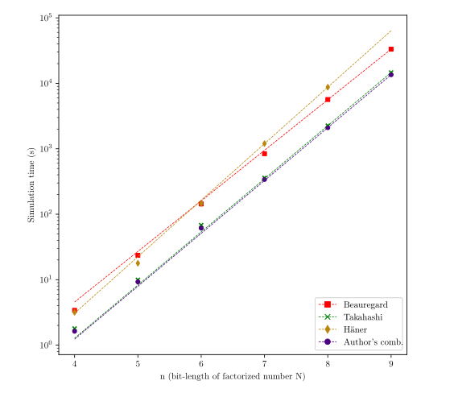
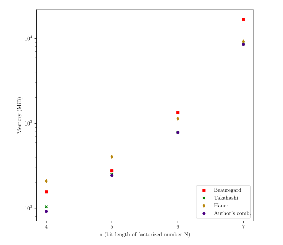
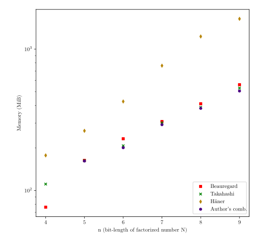
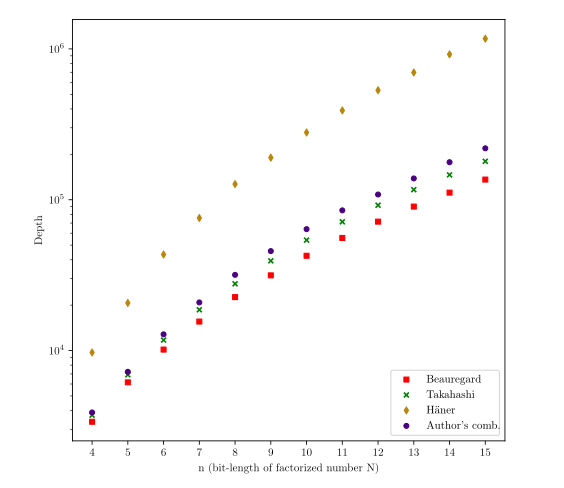
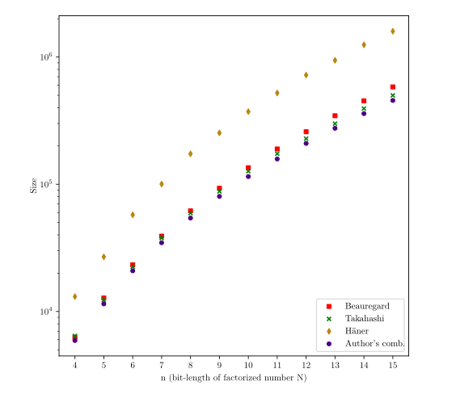

# Shor's Algorithm for IBM Qiskit

This repository contains the code accompanying the master's thesis titled 'Shor's Algorithm for IBM Qiskit' defended in 2021. It serves as a scientific resource for students taking a course on quantum computing.

## Requirements

* Python version >= 3.8
* IBMQ account with saved credentials (for better performance of simulation)  
* Basic knowledge about Shor's algorithm ;)

## Installation

1. Clone (or fork) repository and enter project directory.
```bash
git clone https://github.com/bartek-bartlomiej/master-thesis.git

cd master-thesis
```

2. Create and activate virtual environment.

```bash
python3.8 -m venv venv

source venv/bin/activate
```

4. Install requirements.

```bash
pip install -r requirements.txt
```

5. For running tests, install development requirements.

```bash
pip install -r requirements-dev.txt
```

## Usage

### For students of quantum course at AGH

Run Jupyter

```bash
jupyter notebook
```

and open `laboratories_notebook.ipynb`.

### For general use

Import class from one of package in `implementations` and create instance:

```python
from implementations.mix import MixShor as Shor

from qiskit import Aer
from qiskit.utils import QuantumInstance

shor = Shor(quantum_instance=QuantumInstance(backend=Aer.get_backend('qasm_simulator')))
```

For constructing quantum part of the algorithm:
```python
circuit = shor.construct_circuit(a=4, N=15, semi_classical=False, measurement=True)
circuit.draw(output='mpl')
```

For acquiring the order `r` of an element `a` in the multiplicative group `(mod N)`:
```python
result = shor.get_order(a=4, N=15, semi_classical=True)
print(result.order)
```

For perform factorization of `N`:
```python
factors = shor.factor(a=4, N=15, semi_classical=True)
print(factors)
```

## Running tests

Run:
```bash
python -m unittest tests/test_implementations.py
```

## License
Copyright (c) 2023 Bartłomiej Stępień

Licensed under the Apache License, Version 2.0 (the "License");
you may not use this file except in compliance with the License.
You may obtain a copy of the License at [http://www.apache.org/licenses/LICENSE-2.0](http://www.apache.org/licenses/LICENSE-2.0).

Unless required by applicable law or agreed to in writing, software
distributed under the License is distributed on an "AS IS" BASIS,
WITHOUT WARRANTIES OR CONDITIONS OF ANY KIND, either express or implied.
See the License for the specific language governing permissions and
limitations under the License.

## About master thesis
Master thesis addressed the subject of variants and implementations of the Shor [[1]](#shor) algorithm - one of the famous examples of Quantum Computing. Methods of optimising the number of qubits in the quantum part of the Shor algorithm was presented as well as the design of a circuit implementing the modular exponentiation operation present in the papers by Beauregard [[2]](#beauregard), Takahashi [[3]](#takahashi), Häner [[4]](#haner) and the author's combination of variants in question:

|                             | Beauregard | Takahashi | Häner           | Author's combination |
|----------------------------:|:----------:|:---------:|:---------------:|:--------------------:|
| **Width (w/o SCQT opt.)**   | $4n+2$     | $4n+1$    | $4n+1$          | $4n+1$               |
| **Width (with SCQT opt.)**  | $2n+3$     | $2n+2$    | $2n+2$          | $2n+2$               |
| **Size**                    | $O(n^4)$   | $O(n^4)$  | $O(n^3\log{n})$ | $O(n^4)$             |
| **Depth**                   | $O(n^3)$   | $O(n^3)$  | $O(n^3\log{n})$ | $O(n^3)$             |

### Evaluation
An evaluation has been carried out to compare the developed implementations - the author's combination of variants performed best in terms of simulation time and circuit size. The regression line confirms the exponential growth of simulation time with an increase in the number of simulated qubits. 

|                        | w/o SCQT opt.                                                                                                        | with SCQT opt.                                                                                                         |
|-----------------------:|:--------------------------------------------------------------------------------------------------------------------:|:----------------------------------------------------------------------------------------------------------------------:|
| **Simulation time**    |                            |                         |
| **Simulation memory**  |  |  |
| **Depth**              |                               | In the case of applying, the depth of the circuit increases by $n$ value.                                              |
| **Size**               |                                 | In the case of applying, the size of the circuit increases by $n$ value.                                               |

### Conclusions
Each solution from the literature has its strengths:

* Takahashi's variant - describes a circuit with the smallest size (among the three works).
* Beauregard's variant - circuit with the smallest depth.
* Häner's variant - circuit with the best asymptotic complexity of size.

On the other hand, the authors' combination proved to be better than Takahashi's variant in terms of size and simulation time of the system.

### References
<a id="shor">[1]</a>
Peter W. Shor, "Polynomial-Time Algorithms for Prime Factorization and Di-
screte Logarithms on a Quantum Computer", [1997](https://arxiv.org/abs/quant-ph/9508027)

<a id="beauregard">[2]</a> 
Stephane Beaureagard, "Circuit for Shor’s algorithm using 2n+3 qubits", [2003](https://arxiv.org/abs/quant-ph/0205095)

<a id="takahshi">[3]</a>
Yasuhiro Takahashi, "Efficient Quantum Circuits For Arithmetic Operations And
Their Applications", [2008](https://uec.repo.nii.ac.jp/?action=pages_view_main&active_action=repository_view_main_item_detail&item_id=1185&item_no=1&page_id=13&block_id=21)

<a id="haner">[4]</a>
Thomas Häner, "Factoring using 2n+2 qubits with Toffoli based modular multiplication", [2017](https://arxiv.org/abs/1611.07995)

